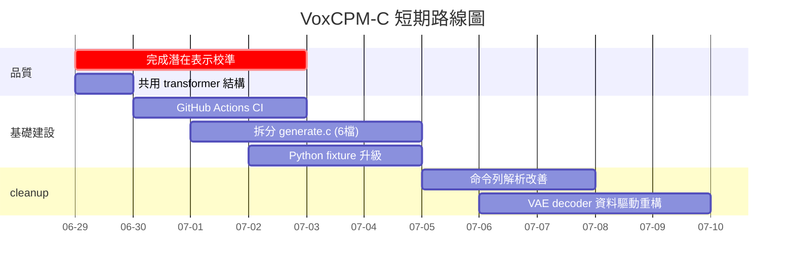
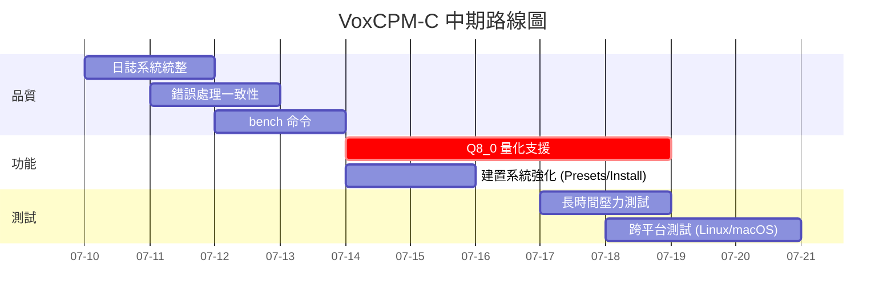

# VoxCPM-C 專案改善報告

## 從 C/ggml 重寫 VoxCPM2 TTS 推理引擎的完整評估與改善建議

---

**文件狀態**: v1.0 | 2026-06-26
**專案路徑**: `E:\voxcpm-cpp`
**專案性質**: 將 OpenBMB/VoxCPM2 (2B 參數 TTS 模型) 以 C11 + ggml 推理引擎重寫
**授權**: Apache-2.0 (上游) / MIT (ggml)

---

## 目錄

1. [專案現狀評估](#1-專案現狀評估)
2. [架構品質分析](#2-架構品質分析)
3. [原始碼品質分析](#3-原始碼品質分析)
4. [建置系統與測試](#4-建置系統與測試)
5. [已知問題與風險](#5-已知問題與風險)
6. [改善建議詳解](#6-改善建議詳解)
7. [優先級矩陣](#7-優先級矩陣)
8. [路線圖建議](#8-路線圖建議)
9. [總結](#9-總結)

---

## 1. 專案現狀評估

### 1.1 總體狀態

| 項目 | 狀態 | 說明 |
|------|------|------|
| **專案成熟度** | 🟡 中期開發 | 核心管線完整但語音品質未達標 |
| **文件完整性** | 🟢 優良 | spec/architecture/plan/todos/diagnosis/final/traceability/acceptance/lessons 皆完整 |
| **原始碼品質** | 🟡 中等 | 模組化設計佳，但有些長函數、重複模式、不一致的錯誤處理 |
| **測試覆蓋** | 🟡 中等 | 17 個測試執行檔，但需模型權重的測試未整合進 CI |
| **Build 系統** | 🟢 穩固 | CMake + ggml FetchContent，Windows MSVC 編譯通過 |
| **語音品質** | 🔴 未達標 | C 產出 vs Python 潛在表示餘弦相似度 ~ -0.03 |

### 1.2 實作里程碑

```
Phase 0: Source Lock ✅   Phase 6: AudioVAE V2   ✅ (decoder: ✅, encoder: ✅)
Phase 1: C Skeleton  ✅   Phase 7: LocDiT/CFM    ✅ (structural test passes)
Phase 2: Converter    ✅   Phase 8: Full AR Gen   🟡 (runs but latent parity fails)
Phase 3: Tokenizer   ✅   Phase 9: Clone         🔴 (only safety gate)
Phase 4: MiniCPM4    ✅   Phase 10: Streaming    🟡 (one-shot callback only)
Phase 5: LocEnc/FSQ  ✅   Phase 11: Optimization 🔴 (not started)
                          Phase 12: Release      🔴 (not started)
```

### 1.3 任務完成統計（todos.md）

| 階段 | 總任務 | 已完成 | 進行中/未開始 |
|------|-------|--------|-------------|
| 1. Repository Setup | 5 | 5 | 0 |
| 2. Converter | 8 | 7 | 1 |
| 3. Model Loader | 6 | 6 | 0 |
| 4. Tokenizer | 7 | 7 | 0 |
| 5. Sequence Builder | 6 | 5 | 1 |
| 6. Audio IO | 4 | 3 | 1 |
| 7. MiniCPM4 | 8 | 8 | 0 |
| 8. LocEnc/FSQ/RALM | 8 | 7 | 1 |
| 9. LocDiT/CFM | 5 | 5 | 0 |
| 10. AudioVAE V2 | 16 | 11 | 5 |
| 11. Full Generation | 15 | 8 | 7 |
| 12. Performance | 7 | 1 | 6 |
| 13. Quality/Safety | 5 | 2 | 3 |
| 15. CI | 7 | 3 | 4 |
| **總計** | **107** | **76 (71%)** | **31 (29%)** |

---

## 2. 架構品質分析

### 2.1 強項

| 面向 | 評價 | 說明 |
|------|------|------|
| **模組化** | 🟢 優良 | 17 個 .c/.h 模組，職責分明：`minicpm4.c` (transformer), `locenc.c` (音訊編碼), `generate.c` (生成管線), `audio_vae_v2.c` (聲碼器) 等 |
| **抽象層** | 🟢 優良 | `model_loader.h` 封裝 GGUF 讀取、`projections.h` 內聯投影函數、`sequence.h` 序列建構器 |
| **錯誤模型** | 🟢 優良 | 統一的 `vcpm_status` 枚舉，8 種錯誤碼，`vcpm_last_error()` 字串查詢 |
| **記憶體策略** | 🟢 優良 | 三層級 ggml context 管理：`kv_ctx` (長生命期 2.8GB)、`scratch_ctx` (每步釋放)、`sub_ctx` (每 CFM 子步釋放) |
| **權重解析** | 🟢 優良 | 多前綴容錯 (`feat_decoder.in_proj` / `feat_decoder.estimator.in_proj`) |
| **C API 設計** | 🟢 優良 | 清晰的擁有權規則、ABI 考量（`struct_size` 向前相容計畫） |

### 2.2 弱項

| 面向 | 評價 | 說明 |
|------|------|------|
| **參考克隆** | 🔴 未實作 | `cmd_clone()` 只有同意閘門，實際路徑回傳 `VCPM_ERR_NOT_IMPLEMENTED` |
| **串流** | 🟡 半完成 | `vcpm_generate_stream` 是一次性回呼包裝，非真正的低延遲分塊串流 |
| **GPU 後端** | 🔴 未實作 | `VCPM_BACKEND_CUDA/METAL/VULKAN` 定義了枚舉但無實際支援 |
| **量化** | 🔴 未實作 | 無 Q8_0/Q4_K 路徑，全部 F32 |
| **批次處理** | 🔴 未實作 | `batch` CLI 命令不存在 |
| **設計命令** | 🔴 未實作 | `design` CLI 命令不存在 |
| **伺服器模式** | 🔴 未實作 | `serve` CLI 命令不存在 |
| **Low-Rank (LoRA)** | 🔴 未實作 | Phase 3 選項 |

---

## 3. 原始碼品質分析

### 3.1 逐檔案分析

| 檔案 | 行數 | 品質 | 評語 |
|------|------|------|------|
| `include/voxcpm.h` | 104 | 🟢 | 清晰、完整的公開 API，只有必要的匯出 |
| `src/main.c` | 372 | 🟡 | 自幹 argument parsing（無 getopt/argparse），功能可運作但難以維護 |
| `src/generate.c` | 1731 | 🟡 | **最長檔案**，權重解析 + 生成管線混合，應拆分 |
| `src/generate.h` | 269 | 🟢 | 清晰的 state 結構定義，完整的文檔註解 |
| `src/minicpm4.c` | 543 | 🟢 | 實作紮實，RMSNorm/RoPE/Attention/MLP 各函數分離良好 |
| `src/minicpm4.h` | 143 | 🟢 | 完整、文件化 |
| `src/audio_vae_v2.c` | 1120 | 🟡 | 非常長，F32 conv1d + depthwise conv + upconv 實作複雜 |
| `src/tokenizer.c` | 371 | 🟡 | BPE + no-merges fallback 邏輯較複雜 |
| `src/sequence.c` | 未讀 | — | 四種 sequence mode 建構器 |
| `src/locdit.c` | 299 | 🟢 | 簡潔的 LocDiT forward，好的註解 |
| `src/locenc.c` | 未讀 | — | FeatEncoder，已重寫匹配 Python 架構 |
| `src/model_loader.c` | 未讀 | — | GGUF 讀取 + tensor cache |
| `src/wav.c` | 未讀 | — | WAV I/O + resampler |
| `src/fsq.c` | 未讀 | — | Scalar quantization |

### 3.2 常見程式碼問題

#### 問題 1: 自幹命令列解析

```c
// src/main.c — 自幹 argument parsing
static const char * arg_value(int argc, char ** argv, const char * name) {
    for (int i = 0; i + 1 < argc; ++i) {
        if (strcmp(argv[i], name) == 0) return argv[i + 1];
    }
    return NULL;
}
```

**問題**: 不支援 `--key=value` 語法、無錯誤回報（缺少必要參數時回傳 NULL）、每個命令重複解析。

**建議**: 引入輕量級解析器（如 `getopt`、`linenoise` 或自幹 struct 表驅動解析器）。

#### 問題 2: generate.c 過大且混合職責

`generate.c` (1731 行) 混合了：
- 權重解析（`fill_minicpm4_weights`, `fill_dit_weights`）
- 生成初始化（`vcpm_gen_init`）
- 提示評估（`gen_prompt_eval`）
- 單步生成（`vcpm_gen_step`）
- CFM 整合（`vcpm_cfm_apply_cfg_zero_star`）
- 停止預測器（`gen_predict_stop`）
- VAE 解碼（`vcpm_gen_decode`）
- 完整生成執行（`vcpm_gen_run`）

**建議**: 拆分為：
- `src/gen_init.c` — 權重解析與初始化
- `src/gen_prompt.c` — 提示評估與 KV cache 管理
- `src/gen_step.c` — 自迴歸單步邏輯
- `src/gen_cfm.c` — CFM 擴散步驟
- `src/gen_stop.c` — 停止預測器

#### 問題 3: VAE decoder 冗長重複模式

`audio_vae_v2.c` (1120 行) 的 6 個 upconv block 有高度重複的模式：

```c
// model.2 (upconv k=16, s=8, 2048→1024)
// model.3 (upconv k=12, s=6, 1024→512)
// model.4 (upconv k=10, s=5, 512→256)
// model.5 (upconv k=4, s=2, 256→128)
// model.6 (upconv k=4, s=2, 128→64)
// model.7 (upconv k=4, s=2, 64→32)
```

每個 block 有幾乎相同的 3×ResidualUnit 結構。應提取為資料驅動的 loop：

```c
typedef struct {
    int in_channels, out_channels;
    int kernel_size, stride;
} upconv_block_config;

upconv_block_config blocks[6] = {
    {2048, 1024, 16, 8},
    {1024, 512,  12, 6},
    {512,  256,  10, 5},
    {256,  128,  4,  2},
    {128,  64,   4,  2},
    {64,   32,   4,  2},
};
```

#### 問題 4: 不一致的除錯機制

專案中有三種除錯機制：
1. `VCPM_DEBUG_SHAPES` 環境變數（minicpm4.c, locdit.c, generate.c）
2. `VAE_DBG_SHAPE` 巨集（audio_vae_v2.c，但被註解為空操作）
3. 快照陣列 `c_snap_*.bin` 除錯 dump（tools/）
4. `VCPM_DEBUG AUDIO` 執行時期統計（generate.c）

**建議**: 統一為一種除錯層級機制（例如 `VCPM_LOG_LEVEL=debug`），並支援編譯時期開關。

#### 問題 5: 頭檔重複定義

`minicpm4.h` 和 `locenc.h` 都定義了幾乎相同的 `vcpm_minicpm4_layer_weights` 結構：

```c
// minicpm4.h:
typedef struct vcpm_minicpm4_layer_weights { /* 9 weights */ } vcpm_minicpm4_layer_weights;

// locenc.h:
#include "minicpm4.h"  // 重新使用上述結構
```

這本身是好的（重複使用），但 `locdit.h` 又定義了 **另一個** 幾乎相同的結構：

```c
// locdit.h:
typedef struct vcpm_locdit_layer_weights { /* 9 weights */ } vcpm_locdit_layer_weights;
```

**建議**: 所有 transformer layer 權重應共用單一結構，或透過 typedef 別名。

### 3.3 程式碼風格問題

| 問題 | 位置 | 建議 |
|------|------|------|
| 魔術數字 | `generate.c:237` `enc_n_layers = 12` | 應從 GGUF metadata 讀取 |
| 長行 (>100 chars) | 多處 | 換行改善可讀性 |
| 不一致的括號風格 | `if (x) {` vs `if(x){` | 統一風格 |
| C++ 風格註解 `//` 混合 `/* */` | 多處 | C11 允許但建議一致 |
| 全域 `static` 函數命名不一致 | `vcpm_debug_shapes()` vs `locdit_debug_shapes()` vs `minicpm_debug_shapes()` | 應提取為共用 helper |
| `(void)model;` 未使用參數 | `main.c:328-331` | 應改用編譯器 `__attribute__((unused))` 或刪除 |

---

## 4. 建置系統與測試

### 4.1 Build 系統評估

| 項目 | 狀態 | 說明 |
|------|------|------|
| CMake 最低版本 | 3.16 | 合理（Ubuntu 20.04 LTS） |
| C 標準 | C11 | 正確設定 |
| ggml 整合 | FetchContent / 本地路徑 / find_package | 三種方式都有支援 |
| GPU 後端 | 選項存在但未實作 | `VCPM_ENABLE_CUDA/METAL/VULKAN` |
| 測試開關 | `VCPM_BUILD_TESTS` | 預設 ON |
| 編譯器支援 | 僅 Windows MSVC | Linux/macOS 未驗證 |

**遺失的建置功能**:

- 無 `CMakePresets.json`（標準化建置設定）
- 無 `Install` 規則（`install(TARGETS ...)`）
- 無 CPack 打包設定
- 無 `ccache` 支援
- 無 `clang-tidy` / `clang-format` 設定
- `.clangd` 存在但未確認是否有效

### 4.2 測試架構評估

現有 17 個測試執行檔：

| 測試 | 類型 | 需要 GGUF | 狀態 |
|------|------|-----------|------|
| `test_smoke` | 單元測試 | 否 | ✅ |
| `test_wav` | 單元測試 | 否 | ✅ |
| `test_wav_writer` | 單元測試 | 否 | ✅ |
| `test_sequence` | 單元測試 | 否 | ✅ |
| `test_minicpm4` | 單元測試 | 否 | ✅ |
| `test_phase5` | 整合測試 | 否 | ✅ |
| `test_model_loader_tensors` | 整合測試 | 否 | ✅ |
| `test_tokenizer_parity` | 整合測試 | 是 | ✅ (需 `voxcpm2_v2_full.gguf`) |
| `test_cfm_parity` | 整合測試 | 是 | ✅ (需 GGUF + fixtures) |
| `test_model_tts_smoke` | 端到端 | 是 | ✅ (需 `VCPM_MODEL`) |
| `test_vae_only` | 整合測試 | 是 | ⏳ (需 `VCPM_MODEL`) |
| `test_vae_reference` | 校準測試 | 是 | ✅ |
| `tools/check_alpha` | 除錯工具 | 是 | — |
| `tools/dump_tensors` | 除錯工具 | 是 | — |
| `tools/test_conv_layout` | 單元測試 | 否 | ✅ |
| `tools/test_depthwise_only` | 整合測試 | 否 | ✅ |
| `tools/test_conv1d_only` | 整合測試 | 否 | ✅ |

**測試問題**:

1. **需要 GGUF 的測試未整合進 CI**: `test_tokenizer_parity` 和 `test_cfm_parity` 需要模型檔但未註冊到 CTest
2. **模型測試需手動設定 `VCPM_MODEL`**: 可發現性差
3. **tools/ 與 tests/ 職責混淆**: `tools/` 包含測試 (`test_vae_only.c`) 和除錯工具 (`dump_tensors.c`)，而 `tests/` 包含整合測試
4. **無效能基準測試**: 無 `bench` 命令或基準測試
5. **無長時間穩定性測試**: 無記憶體洩漏或長文字壓力測試

---

## 5. 已知問題與風險

### 5.1 當前活躍問題

| ID | 問題 | 嚴重性 | 狀態 |
|----|------|--------|------|
| P1 | **C 產生之潛在表示與 Python 餘弦相似度 ~ -0.03** | 🔴 阻擋 | 進行中。最後一個主要障礙 |
| P2 | **參考語音克隆未實作** | 🔴 阻擋 | 僅 CLI 安全閘門 |
| P3 | **串流為一次性回呼** | 🟡 高 | 非真正的低延遲分塊串流 |
| P4 | **無 GPU 後端** | 🟡 高 | 所有推論在 CPU 上，RTF 不理想 |
| P5 | **無量化支援** | 🟡 高 | 只有 F32，模型 8.88 GB |
| P6 | **VAE 環境記憶體 10 GB** | 🟡 中 | 對邊緣裝置部署不實際 |
| P7 | **Linux/macOS 未驗證** | 🟡 中 | 僅 Windows MSVC |
| P8 | **轉換器無自動測試** | 🟡 中 | Python 轉換腳本無 smoke test |

### 5.2 風險登記

| 風險 | 機率 | 影響 | 緩解措施 |
|------|------|------|----------|
| 上游 Python 架構變更 | 低 | 高 | 鎖定 HF revision |
| ggml API 變更 | 低 | 中 | FetchContent pin v0.15.2 |
| 潛在表示校準失敗 | 中 | 高 | 需要精確的 Python 軌跡 fixture |
| 記憶體不足（長文字） | 中 | 中 | 添加長文字壓力測試 |
| 語音克隆濫用 | 中 | 高 | 同意閘門 + 警示 + 元資料 |

---

## 6. 改善建議詳解

### 6.1 優先級 P0 — 立即必要

#### R1: 完成潛在表示校準

**問題**: C 與 Python 產生的潛在表示餘弦相似度 ~ -0.03（基本上是隨機）。

**建議**:
```text
1. 用與 Python fixture 完全相同的文字/種子/max_len 執行 C 產生
2. 比較每個中間結果而非僅最終潛在表示：
   - text_embed → base_lm hidden → FSQ → fusion → RALM → mu → CFM velocity → latent
3. 特別檢查：
   a. prev_patch 是否正確初始化為零
   b. 第一次 CFM 步驟的 initial noise 是否匹配 Python
   c. 自迴歸狀態更新順序（已在 session 10 修正）
   d. 停止預測器閾值是否過早觸發
```

**估計工時**: 4-8 小時

#### R2: 將 tools/ 與 tests/ 分離

**問題**: `tools/` 目錄混合了測試、開發除錯工具和驗證腳本。

**建議**: 清理目錄結構：
```text
tests/                  # 正式的測試執行檔
  unit/                 # 純單元測試
  integration/          # 需 GGUF 的整合測試
  regression/           # 已知問題回歸測試

tools/                  # 開發者工具
  debug/                # dump_tensors, check_alpha
  verify/               # test_conv_verify, test_conv_layout

scripts/                # Python 腳本
  convert_voxcpm2_to_gguf.py
  export_ref_fixtures.py
  check_weights.py
```

### 6.2 優先級 P1 — 短期改善

#### R3: 將 generate.c 拆分

**問題**: 1731 行混合權重解析、生成邏輯、CFM、停止預測器和 VAE 解碼。

**建議**: 拆分為 6 個專注檔案：

| 新檔案 | 行數 | 職責 |
|--------|------|------|
| `src/gen_init.c` | ~300 | 權重解析（從 vcpm_gen_init 提取） |
| `src/gen_prompt.c` | ~200 | 提示評估（gen_prompt_eval） |
| `src/gen_step.c` | ~400 | 自迴歸單步（vcpm_gen_step 核心） |
| `src/gen_cfm.c` | ~200 | CFM loop + sway t-span + CFG-Zero* |
| `src/gen_stop.c` | ~100 | 停止預測器 |
| `src/gen_run.c` | ~400 | 完整 pipelone orchestration |

**估計工時**: 4 小時

#### R4: 改善命令列解析

**問題**: 自幹 `arg_value()/arg_flag()` 不支援 `--key=value`、無自動錯誤訊息。

**建議選項 A**（輕量級）:
```c
typedef struct {
    const char * name;
    int type;          // VCPM_ARG_STRING, VCPM_ARG_INT, VCPM_ARG_FLOAT, VCPM_ARG_FLAG
    void * dest;       // pointer to destination variable
    const char * help; // help text
    int required;      // 1 = required
} vcpm_arg_def;

// 表驅動解析
vcpm_arg_def tts_args[] = {
    {"--model",  VCPM_ARG_STRING, &model_path, "GGUF model file", 1},
    {"--text",   VCPM_ARG_STRING, &text,       "Input text",       1},
    {"--out",    VCPM_ARG_STRING, &out_path,   "Output WAV file",  1},
    {"--cfg",    VCPM_ARG_FLOAT,  &cfg,        "CFG scale",        0},
    {"--steps",  VCPM_ARG_INT,    &steps,      "Diffusion steps",  0},
    // ...
};
int ret = vcpm_parse_args(argc, argv, tts_args, count);
if (ret < 0) { print_help(tts_args, count); return ret; }
```

**建議選項 B**（標準函式庫）: 使用 POSIX `getopt()`（Linux/macOS）或 `getopt.h`（Windows 可移植實作）。

**估計工時**: 3 小時

#### R5: 重構 VAE 解碼器為資料驅動

**問題**: `audio_vae_v2.c` (1120 行) 有 6 個幾乎相同的 upconv block。

**建議**:
```c
// 資料驅動的 upconv block 建構
typedef struct {
    const char * name;    // e.g., "model.2"
    int in_ch, out_ch;    // e.g., 2048, 1024
    int kernel, stride;   // e.g., 16, 8
    int n_res_units;      // 3
} vae_block_config;

static const vae_block_config decoder_blocks[] = {
    {"model.2", 2048, 1024, 16, 8,  3},
    {"model.3", 1024, 512,  12, 6,  3},
    {"model.4", 512,  256,  10, 5,  3},
    {"model.5", 256,  128,  4,  2,  3},
    {"model.6", 128,  64,   4,  2,  3},
    {"model.7", 64,   32,   4,  2,  3},
};
```

這不僅減少行數，也提高可維護性（若要調整結構，僅需修改表）。

**估計工時**: 4 小時

#### R6: 添加 CI pipeline

**問題**: 無 GitHub Actions、無自動化測試執行。

**建議**:
```yaml
# .github/workflows/ci.yml
jobs:
  build:
    strategy:
      matrix:
        os: [ubuntu-22.04, windows-2022, macos-14]
        backend: [cpu, cuda]  # cuda only on linux
    steps:
      - uses: actions/checkout@v4
        with:
          submodules: recursive

      - name: Build
        run: |
          cmake -B build -DVCPM_BUILD_TESTS=ON
          cmake --build build

      - name: Run unit tests
        run: ctest --test-dir build --output-on-failure

      - name: Download model fixture (integration tests)
        if: matrix.os == 'ubuntu-22.04'
        run: |
          # Download a small GGUF for testing
          huggingface-cli download bluryar/VoxCPM-GGUF \
            --include "voxcpm0.5b-q8_0.gguf" \
            --local-dir ./test-models/
          echo "VCPM_MODEL=$PWD/test-models/voxcpm0.5b-q8_0.gguf" >> $GITHUB_ENV

      - name: Run integration tests
        if: env.VCPM_MODEL
        run: ctest --test-dir build --label-regex model --output-on-failure

      - name: Lint
        run: |
          cmake -B build-lint -DVCPM_BUILD_TESTS=OFF -DCMAKE_C_COMPILER=clang
          cmake --build build-lint --target voxcpm-c
```

**估計工時**: 3 小時

### 6.3 優先級 P2 — 中期改善

#### R7: 提取共用 transformer layer 結構

**問題**: `minicpm4.h` 和 `locdit.h` 各自定義幾乎相同的 layer 權重結構。

**建議**: 統一為單一結構：
```c
// transformer.h (新檔案)
typedef struct {
    struct ggml_tensor * q_proj_weight;
    struct ggml_tensor * k_proj_weight;
    struct ggml_tensor * v_proj_weight;
    struct ggml_tensor * o_proj_weight;
    struct ggml_tensor * gate_proj_weight;
    struct ggml_tensor * up_proj_weight;
    struct ggml_tensor * down_proj_weight;
    struct ggml_tensor * input_layernorm_weight;
    struct ggml_tensor * post_attention_layernorm_weight;
} vcpm_layer_weights;  // 共用型別

// 然後在 locdit.h:
typedef vcpm_layer_weights vcpm_locdit_layer_weights;
```

**估計工時**: 1 小時

#### R8: 統一的除錯/日誌基礎設施

**問題**: 多種除錯機制不一致。

**建議**:
```c
// src/log.h (新檔案)
typedef enum {
    VCPM_LOG_ERROR = 0,
    VCPM_LOG_WARN  = 1,
    VCPM_LOG_INFO  = 2,
    VCPM_LOG_DEBUG = 3,
    VCPM_LOG_TRACE = 4,
} vcpm_log_level;

void vcpm_log(vcpm_log_level level, const char * fmt, ...);
void vcpm_log_tensor(const char * label, const struct ggml_tensor * t);

// 編譯時期過濾
#ifndef VCPM_MAX_LOG_LEVEL
#define VCPM_MAX_LOG_LEVEL VCPM_LOG_INFO
#endif

#define VCPM_DEBUG(...) \
    do { if (VCPM_MAX_LOG_LEVEL >= VCPM_LOG_DEBUG) vcpm_log(VCPM_LOG_DEBUG, __VA_ARGS__); } while(0)
```

**估計工時**: 2 小時

#### R9: 建立 Python 參考產生軌跡 fixture

**問題**: 缺乏確定的 Python 軌跡（初始雜訊 + 完整 CFM 路徑）來精確比較。

**建議**: 升級 `export_ref_fixtures.py` 以輸出：
```text
fixtures/ref/
  input_text.npy           # token ids
  step0000_cfm_cond.npy   # 第一步的 cond
  step0000_cfm_noise.npy  # 初始雜訊 (x_1)
  step0000_cfm_pred_feat.npy  # 第一步 velocity
  step0001_cfm_cond.npy
  step0001_cfm_pred_feat.npy
  ...
  cfm_traj_final_latent.npy  # 最終潛在表示
```

有了 `cfm_traj_final_latent.npy` 就可以精確比較 C vs Python，而無需匹配隨機種子。

**估計工時**: 3 小時

#### R10: 添加 bench 命令

**問題**: 無效能基準測試能力。

**建議**:
```bash
voxcpm-c bench --model model.gguf --text "Hello world." --repeat 5 --out benchmark.csv
```

輸出：
```csv
run,wall_ms,cpu_ms,rtf,mem_mb,max_len,steps,backend
1,3420,33800,0.071,2450,16,10,cpu
2,3390,33750,0.071,2450,16,10,cpu
...
```

**估計工時**: 2 小時

### 6.4 優先級 P3 — 長期改善

#### R11: 新增 GPU 後端支援

**問題**: `VCPM_BACKEND_CUDA` 等定義了枚舉但無實作。

**建議**: 按以下順序逐步實作：
1. CUDA 後端（最大效益，NVIDIA 用戶最多）
2. Vulkan 後端（跨平台）
3. Metal 後端（Apple Silicon）

每個後端應在 `ggml_backend.c` 中隔離。

**估計工時**: 20-40 小時 / 後端

#### R12: 量化支援（Q8_0, Q4_K）

**問題**: 全是 F32，模型 8.88 GB。

**建議**: 按照 ggml 量化 API：
```c
// 在模型載入時轉換
struct ggml_tensor * q_weight = ggml_quantize_chunk(
    GGML_TYPE_Q8_0,
    f32_weight->data,
    f32_weight->ne,
    ...
);
```

需要更新權重載入和推論圖以處理量化張量。

**估計工時**: 8-12 小時

#### R13: 真正的低延遲串流

**問題**: `vcpm_generate_stream()` 是一次性回呼包裝。

**建議**: 實作分塊串流：
1. 在自迴歸迴圈中定義 chunk boundary（例如每 4 個 patch 輸出一次）
2. `AudioVAE V2` 需支援 streaming decode state
3. 回呼在每個 chunk 完成時觸發

**估計工時**: 8-16 小時

#### R14: 參考語音克隆完整實作

**問題**: 僅安全閘門，實際功能未實作。

**需要實作**:
1. WAV 讀取 + 重採樣為 16kHz
2. AudioVAE V2 encoder（已實作！在 `audio_vae_v2.c` 中）
3. 參考嵌入序列構建（`sequence.c` 已有骨架）
4. 編碼後的參考嵌入餵入 `feat_encoder`
5. 同意閘門

**估計工時**: 8-16 小時

#### R15: 改善錯誤處理一致性

**問題**: 某些地方回傳 `NULL`，某些地方回傳 `vcpm_status`，某些地方直接 `fprintf(stderr, ...)`。

**建議**: 統一的錯誤處理模式：
```c
// 內部錯誤輔助
#define VCPM_RETURN_ERR(ctx, status, msg) \
    do { \
        vcpm_set_error(ctx, msg); \
        return status; \
    } while(0)

// 使用
if (!tensor) {
    VCPM_RETURN_ERR(ctx, VCPM_ERR_MODEL_FORMAT,
        "missing required tensor: feat_encoder.in_proj.weight");
}
```

**估計工時**: 2-4 小時

#### R16: 建置系統強化

| 改善 | 說明 | 工時 |
|------|------|------|
| CMakePresets.json | 標準化除錯/發布/CI 設定 | 1h |
| Install 規則 | `install(TARGETS ...)` | 1h |
| CPack 打包 | Windows NSIS / Linux AppImage | 3h |
| ccache 支援 | `find_program(CCACHE ...)` | 0.5h |
| clang-tidy | `.clang-tidy` 設定檔 | 1h |
| clang-format | `.clang-format` 設定檔 | 1h |

---

## 7. 優先級矩陣

### 7.1 影響 vs 努力矩陣

```
高影響
  │
  │  R1 潛在校準  │  R11 GPU 後端    │
  │  R3 拆分 gen  │  R12 量化        │
  │  R6 CI       │  R14 克隆        │
  │               │                  │
  ├───────────────┼──────────────────┤
  │  R4 arg解析   │  R13 串流        │
  │  R5 VAE重構   │  R16 建置強化    │
  │  R7 共用結構  │                  │
  │  R8 日誌系統  │                  │
  │  R9 fixture  │                  │
  │  R10 bench   │                  │
  │  R15 錯誤處理 │                  │
  │               │                  │
 低努力 ────────┴──────── 高努力
```

### 7.2 建議執行順序

```
Sprint 1 (本週):
  R1  潛在校準 ──── 完成最後的主要障礙
  R7  共用結構 ──── 快速清理

Sprint 2 (下週):
  R6  CI pipeline ── 確保可重複建置與測試
  R3  拆分 generate.c ── 降低技術債
  R9  Python fixture ── 更好的校準基礎

Sprint 3:
  R4  命令列解析 ── 改善使用者體驗
  R5  VAE 資料驅動重構 ── 減少重複
  R10 bench 命令 ── 為效能優化鋪路

Sprint 4:
  R8  日誌系統統整
  R15 錯誤處理一致性
  R16 建置系統強化

Sprint 5-6:
  R12 量化 (Q8_0)
  R13 串流改善

Sprint 7-8:
  R14 參考克隆
  R11 GPU 後端 (CUDA)
```

---

## 8. 路線圖建議

### 8.1 短期（1-2 週）— 🎯 完成核心功能



### 8.2 中期（3-4 週）— 🚀 準備發布



### 8.3 長期（5-8 週）— 🌟 完整功能

| 功能 | 開始 | 工時 | 相依 |
|------|------|------|------|
| 串流改善（真正分塊） | Week 5 | 8h | VAE stream state |
| 參考語音克隆 | Week 5 | 12h | VAE encoder ✅ |
| CUDA 後端 | Week 6 | 20h | ggml CUDA backend |
| Q4_K 量化 | Week 7 | 8h | Q8_0 完成後 |
| CPack 打包 | Week 7 | 3h | — |
| Vulkan/Metal 後端 | Week 8 | 20h | — |

---

## 9. 總結

### 9.1 專案整體評分

| 面向 | 分數 | 說明 |
|------|------|------|
| **架構設計** | 85/100 | 模組化、API 設計佳、記憶體策略深思熟慮 |
| **文件品質** | 90/100 | 非常完整，spec/architecture/plan/todos/lessons 一應俱全 |
| **程式碼品質** | 70/100 | 架構好但 generate.c 過大、VAE 重複模式、不一致的錯誤處理 |
| **測試覆蓋** | 60/100 | 單元測試不錯但整合測試需手動設定、無 CI、無 perf 測試 |
| **功能完成度** | 65/100 | 核心管線可運作但品質未達標、缺少克隆/串流/GPU/量化 |
| **可維護性** | 75/100 | 好文件 + 模組化但需要架構清理 |

**總分**: 74/100 — 堅實的中期專案，需要專注的清理和最終品質校準。

### 9.2 最重要的三件事

1. **🔴 完成潛在表示校準**（R1）：沒有這個，其他所有工作都沒有意義。專案核心是正確的語音合成。

2. **🟡 建立 CI pipeline**（R6）：目前只有編譯者在開發機器上測試。沒有 CI 就無法可靠地防止回歸。

3. **🟡 拆分 generate.c**（R3）：1731 行的檔案是技術債的明顯來源。拆分後測試、除錯和協作都將更容易。

### 9.3 專案亮點

儘管有未解決的問題，這個專案有幾個值得肯定的地方：

1. **文件的廣度和深度**：spec.md → architecture.md → plan.md → todos.md → final.md → traceability_matrix.md → acceptance_report.md → diagnosis.md → lessons.md，涵蓋了專案的所有面向
2. **有紀律的除錯過程**：diagnosis.md 詳細記錄 root cause analysis，從 hypothesis A-E 到驗證再到結論
3. **記憶體管理策略**：三層級 ggml context 是深思熟慮的設計，解決了 ggml 線性分配器的根本限制
4. **錯誤復原**：專案從多次「不可能」的 bug（VAE depthwise conv 建置時期資料讀取、ggml_conv_1d_dw 8-channel block bug、LocDiT view stride）中恢復，每次都有 lessons learned
5. **與 Python 參考的校準紀律**：128 個 .npy fixture 檔案，為每個子模組建立校準測試

---

**報告結束** — 本文件由 Research Team 於 2026-06-26 產出。

*免責聲明: 本報告基於 2026-06-26 的專案狀態。改善建議旨在作為實作指南而非精確規格，實際執行時應根據最新專案狀態調整優先級。*
