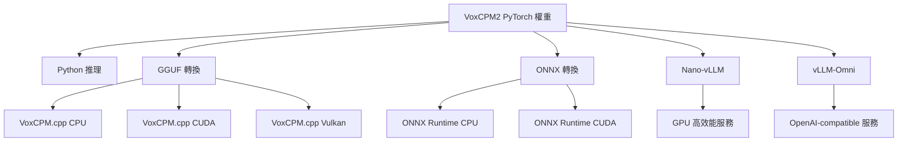

# VoxCPM2 TTS 模型研究報告

## 從 Python API 到 GGML/GGUF C 語言轉換與語音生成完整流程

---

**文件狀態**: v1.0 | 2026-06-26
**模型來源**: [openbmb/VoxCPM2](https://huggingface.co/openbmb/VoxCPM2) (Apache-2.0)
**技術報告**: [arXiv:2606.06928](https://arxiv.org/abs/2606.06928)
**官方倉庫**: [OpenBMB/VoxCPM](https://github.com/OpenBMB/VoxCPM)

---

## 目錄

1. [摘要](#1-摘要)
2. [VoxCPM2 模型架構](#2-voxcpm2-模型架構)
3. [Python API 完整使用指南](#3-python-api-完整使用指南)
4. [語音生成流程詳解](#4-語音生成流程詳解)
5. [GGML/GGUF 格式轉換](#5-ggmlgguf-格式轉換)
6. [VoxCPM.cpp — C++ 推理引擎](#6-voxcpmcpp--c-推理引擎)
7. [Python 與 C++ 效能對比](#7-python-與-c-效能對比)
8. [部署方案比較](#8-部署方案比較)
9. [結論與建議](#9-結論與建議)
10. [參考資料](#10-參考資料)

---

## 1. 摘要

本報告深入研究 **VoxCPM2** — OpenBMB 開發的 2B 參數、無分詞器（Tokenizer-Free）擴散自迴歸語音合成模型。報告涵蓋三個核心面向：

| 面向 | 內容 |
|------|------|
| **Python API** | `voxcpm` 套件的完整函數使用方式、五種生成模式、參數調校 |
| **GGML/GGUF 轉換** | 從 PyTorch `model.safetensors` / `audiovae.pth` 到 GGUF 格式的轉換工具與流程 |
| **C 語言推論** | 基於 ggml 的 `VoxCPM.cpp` 原生 C++ 推理引擎、CLI 與 HTTP Server 使用方式 |
| **語音生成流程** | 從文字輸入到 48kHz 音頻輸出的完整管線：LocEnc → TSLM → RALM → LocDiT → AudioVAE V2 |

**核心發現**:

- VoxCPM2 是市面上最完整的開源 TTS 模型（30 語言、語音設計、可控克隆、48kHz）
- 社群已有成熟的 GGUF 轉換方案（`bluryar/VoxCPM-GGUF`），但 VoxCPM2 (2B) 的 C++ 支援仍處於初步階段
- C++ 版本比 Python 快 2-5 倍，記憶體低 30-60%，適合邊緣裝置部署

---

## 2. VoxCPM2 模型架構

### 2.1 總體架構

VoxCPM2 採用 **無分詞器擴散自迴歸（Tokenizer-Free Diffusion Autoregressive）** 架構，直接在連續潛在空間中建模語音，而非使用離散音訊 Token。

```
文字輸入 (Text)
    │
    ▼
┌─────────────────────────────────────────────────────┐
│                四階段生成管線                        │
│                                                     │
│  LocEnc (局部編碼器)                                │
│  └─ 將歷史音訊壓縮為緊湊的聲學嵌入                  │
│                                                     │
│  TSLM (語義語言模型) ─── FSQ (有限標量量化)         │
│  └─ 基於 MiniCPM-4 處理文字 + 聲學歷史              │
│  └─ 輸出半離散的語義骨架                            │
│                                                     │
│  RALM (殘差聲學語言模型)                            │
│  └─ 恢復細粒度聲學細節 (Concat-Projection 融合)     │
│                                                     │
│  LocDiT (局部擴散 Transformer)                      │
│  └─ 擴散去噪 → 生成當前 patch 的連續潛在表示        │
│                                                     │
└─────────────────────────────────────────────────────┘
    │
    ▼
AudioVAE V2 解碼器 (非對稱: 16kHz → 48kHz)
    │
    ▼
48kHz 波形輸出 (WAV)
```

### 2.2 核心組件

| 組件 | 參數量 | 說明 |
|------|--------|------|
| **MiniCPM-4 Backbone** | ~2B | 基礎語言模型骨幹，處理文字理解 |
| **LocEnc (Local Encoder)** | 輕量 | 壓縮 VAE 潛在 patch 為聲學嵌入，僅局部注意力 |
| **TSLM (Text-Semantic LM)** | — | 自迴歸語言模型，輸出語義骨架經 FSQ 量化 |
| **FSQ (Finite Scalar Quantization)** | — | 有限標量量化瓶頸，約束隱藏狀態空間 |
| **RALM (Residual Acoustic LM)** | 8 層 | 恢復細粒度聲學細節，V2 使用 Concat-Projection 融合 |
| **LocDiT (Local Diffusion Transformer)** | — | 局部擴散 Transformer，每個 patch 獨立去噪 |
| **AudioVAE V2** | — | 非對稱自編碼器 (16kHz 編碼 → 48kHz 解碼)，內建超解析度 |

### 2.3 V2 相比 V1 的主要升級

| 特性 | VoxCPM 1.x | VoxCPM 2 |
|------|-----------|----------|
| Patch 大小 | 2 / 4 | 4 |
| 殘差 LM 層數 | 6 | 8 |
| FSQ 潛在維度 | 256 | 512 |
| 最大序列長度 | 4096 | 8192 |
| AudioVAE 輸出 | 16kHz / 44.1kHz | **48kHz** |
| 編解碼率 | 對稱 | 非對稱 (16kHz→48kHz) |
| RALM 融合 | 加法 | **Concat + Projection** |
| DiT 條件 | 單 Token (加法) | 多 Token (拼接) |
| 參考音訊 | Prompt continuation | **隔離參考通道** |
| 語言數 | 2 (zh, en) | **30** |
| 可控性 | — | **語音設計 + 風格控制** |

---

## 3. Python API 完整使用指南

### 3.1 安裝

```bash
# 基礎安裝 (需 Python ≥ 3.10, PyTorch ≥ 2.5)
pip install voxcpm

# 若要使用 GPU (CUDA 12.0+)
pip install torch torchaudio --index-url https://download.pytorch.org/whl/cu121
```

### 3.2 模型載入

```python
from voxcpm import VoxCPM
import soundfile as sf
import numpy as np

# ── 載入模型（自動下載權重 ~4.96 GB）──
model = VoxCPM.from_pretrained("openbmb/VoxCPM2")

# 檢查取樣率
print(model.tts_model.sample_rate)  # 48000 Hz
```

### 3.3 生成參數一覽

所有生成模式共用以下參數：

| 參數 | 預設值 | 說明 |
|------|--------|------|
| `text` | (必要) | 要合成的文字。支援 30 種語言，自動偵測 |
| `reference_wav_path` | `None` | **V2 新增** 參考音訊，用於語音克隆（隔離參考通道） |
| `prompt_wav_path` | `None` | Prompt 音訊（延續式克隆），需搭配 `prompt_text` |
| `prompt_text` | `None` | Prompt 音訊的逐字稿，與 `prompt_wav_path` 成對使用 |
| `cfg_value` | `2.0` | CFG 引導強度 (1.0–3.0)。越高越貼近條件，越低越多變化 |
| `inference_timesteps` | `10` | LocDiT 推理步數 (5–50)。越高品質越好，速度越慢 |
| `normalize` | `True` | 啟用外部文字正規化工具 (TN) |
| `denoise` | `True` | 啟用外部去噪工具 |
| `retry_badcase` | `True` | 啟用「壞案例重試」模式 |
| `retry_badcase_max_times` | `3` | 最大重試次數 |
| `retry_badcase_ratio_threshold` | `6.0` | 壞案例檢測的長度比閾值 |

### 3.4 五種生成模式

#### 模式 1: 基本 TTS（無參考音訊）

最基本的文字轉語音。模型自動推斷適當的韻律和表現力。

```python
wav = model.generate(
    text="VoxCPM is an innovative end-to-end TTS model from ModelBest, "
         "designed to generate highly expressive speech.",
)
sf.write("output.wav", wav, model.tts_model.sample_rate)
```

#### 模式 2: 語音設計（Voice Design）

**V2 獨有功能** — 僅透過自然語言描述生成全新語音，不需要任何參考音訊。

```python
wav = model.generate(
    text="Hello! Welcome to our guided meditation session. "
         "Take a deep breath and relax.",
    # 在 text 前方包裹描述語句控制音質
    text="(a gentle female voice, soft tone, slow pace)"
         "Hello! Welcome to our guided meditation session.",
)
sf.write("voice_design.wav", wav, model.tts_model.sample_rate)
```

**語音描述範例**:

| 描述語 | 效果 |
|--------|------|
| `(a deep male voice, authoritative)` | 深沉權威的男聲 |
| `(cheerful female voice, fast pace)` | 歡快女聲，快速 |
| `(whisper, mysterious tone)` | 耳語，神秘 |
| `(slightly faster, cheerful tone)` | 稍快，愉快 |
| `(warm, elderly voice, slow)` | 溫暖蒼老，緩慢 |

#### 模式 3: 可控語音克隆（Controllable Voice Cloning）

從短參考音訊克隆語音，並可選擇加入風格引導。

```python
wav = model.generate(
    text="(slightly faster, cheerful tone)"
         "This is a cloned voice with style control.",
    reference_wav_path="speaker.wav",  # 參考音訊（無需逐字稿）
    cfg_value=2.0,
    inference_timesteps=10,
)
sf.write("controllable_clone.wav", wav, model.tts_model.sample_rate)
```

**工作流程**:
```
參考音訊 (speaker.wav) ──→ LocEnc 提取音色嵌入 (隔離參考通道)
                                      │
風格描述 (text 前綴) ──→ TSLM 語義理解
                                      │
                                      ▼
                              合成語音 = 保留原始音色 + 應用風格引導
```

#### 模式 4: 終極克隆（Ultimate Cloning）

提供參考音訊 + 逐字稿，實現最高保真度的語音克隆。

```python
wav = model.generate(
    text="This is an ultimate cloning demonstration using VoxCPM2.",
    prompt_wav_path="speaker_reference.wav",   # 參考音訊
    prompt_text="The transcript of the reference audio.",  # 逐字稿
    reference_wav_path="speaker_reference.wav",  # 同一檔案用於參考通道
)
sf.write("hifi_clone.wav", wav, model.tts_model.sample_rate)
```

**提示**: 將同一音訊同時傳給 `reference_wav_path` 和 `prompt_wav_path` 可達到最高相似度。

#### 模式 5: 串流生成（Streaming）

即時串流生成，適合低延遲應用。

```python
chunks = []
for chunk in model.generate_streaming(
    text="Streaming is easy with VoxCPM!"
):
    chunks.append(chunk)
wav = np.concatenate(chunks)
sf.write("streaming.wav", wav, model.tts_model.sample_rate)
```

### 3.5 API 參考（詳細）

完整的 Python 方法簽名：

```python
class VoxCPM:
    @classmethod
    def from_pretrained(
        cls,
        model_name: str = "openbmb/VoxCPM2",
        device: str | None = None,     # "cuda", "cpu", None=auto
        cache_dir: str | None = None,  # HF cache 目錄
    ) -> VoxCPM: ...

    def generate(
        self,
        text: str,                                   # 合成文字
        reference_wav_path: str | None = None,       # 參考音訊路徑
        prompt_wav_path: str | None = None,          # Prompt 音訊路徑
        prompt_text: str | None = None,              # Prompt 逐字稿
        cfg_value: float = 2.0,                      # CFG 引導 (1.0–3.0)
        inference_timesteps: int = 10,               # 推理步數 (5–50)
        normalize: bool = True,                      # 文字正規化
        denoise: bool = True,                        # 去噪
        retry_badcase: bool = True,                  # 壞案例重試
        retry_badcase_max_times: int = 3,            # 最大重試次數
        retry_badcase_ratio_threshold: float = 6.0,  # 長度比閾值
    ) -> np.ndarray:                                 # 回傳 48kHz 音訊陣列

    def generate_streaming(
        self,
        text: str,
        **kwargs,                                    # 同上 generate 參數
    ) -> Generator[np.ndarray, None, None]:          # 逐 chunk 產生音訊

    def get_info(self) -> dict: ...                  # 引擎資訊
```

### 3.6 命令列工具

安裝 `voxcpm` 後也提供 CLI：

```bash
# 基本 TTS
voxcpm tts --text "Hello world" --output hello.wav

# 語音設計
voxcpm design --text "(deep voice) Hello world" --output design.wav

# 語音克隆 (參考音訊)
voxcpm clone \
    --text "This is a cloned voice." \
    --reference-audio speaker.wav \
    --output clone.wav

# 指定裝置
voxcpm tts --text "Hello" --device cpu --output out.wav

# 完整參數
voxcpm tts \
    --text "Hello VoxCPM" \
    --output out.wav \
    --cfg 2.5 \
    --timesteps 20 \
    --no-denoise
```

---

## 4. 語音生成流程詳解

### 4.1 推理管線逐步驟

```
Step 1: 文字預處理
├── 文字正規化 (normalize=True 時)
├── 語言自動偵測 (30 種語言)
└── Tokenizer-free: 直接輸入原始文字

Step 2: 初始化生成
├── 建立 TSLM context (文字嵌入 + 空聲學歷史)
├── 若有參考音訊 → LocEnc 編碼為參考嵌入
└── 設定停止條件 (StopPredictor)

Step 3: 自迴歸生成每個 patch (6.25 Hz)
├── TSLM: 文字 + 歷史聲學嵌入 → 語義隱狀態
├── FSQ: 有限標量量化 → 半離散語義骨架 h^FSQ
├── RALM: FSQ + LocEnc → 殘差細節 h^residual
├── LocDiT: CFG + Sway Sampling → 去噪生成
│   ├── v_cond = LocDiT(條件隱狀態)
│   ├── v_uncond = LocDiT(無條件隱狀態)
│   └── v = v_uncond + cfg × (v_cond - v_uncond)
└── 檢查 StopPredictor → 決定是否繼續

Step 4: AudioVAE V2 解碼
├── 累積所有 patch 的連續潛在表示
├── AudioVAE V2 Decoder (48kHz)
└── 非對稱解碼: 16kHz 潛在 → 48kHz 波形

Step 5: 後處理
├── Denoise (denoise=True 時)
└── WAV bytes 輸出 (16-bit PCM, 48kHz)
```

### 4.2 CFG (Classifier-Free Guidance)

CFG 是控制生成品質的關鍵參數：

```python
# CFG 演算法 (偽代碼)
for denoising_step in range(inference_timesteps):
    v_cond = loc_dit(latent, condition=hidden_state)
    v_uncond = loc_dit(latent, condition=null_condition)
    v = v_uncond + cfg_value * (v_cond - v_uncond)
    latent = latent_step(latent, v)
```

**cfg_value 調校指南**:

| CFG 值 | 效果 | 適用場景 |
|--------|------|----------|
| 1.0 | 最大變化，可能偏離引導 | 語音設計探索 |
| 1.5–2.0 | 平衡 (預設 2.0) | 一般用途 |
| 2.5–3.0 | 嚴格跟隨引導 | 語音克隆、精確控制 |
| > 3.0 | 可能產生 artifacts | 不建議 |

### 4.3 推理步數與品質權衡

```python
# 步數選擇建議
inference_timesteps = {
    5:  "極速模式 (~0.15 RTF), 品質可接受",
    10: "平衡模式 (~0.30 RTF), 預設值",
    20: "高品質 (~0.60 RTF), 推薦重要場景",
    50: "極致品質 (~1.5 RTF), 品質提升遞減",
}
```

### 4.4 壞案例重試機制

當檢測到異常長度時自動重試：

```python
# 壞案例檢測邏輯
if retry_badcase:
    for attempt in range(retry_badcase_max_times):
        wav = generate_one(text)
        length_ratio = len(wav) / expected_length
        if length_ratio < retry_badcase_ratio_threshold:
            break  # 正常範圍
        # 否則重試 (不同隨機種子)
```

---

## 5. GGML/GGUF 格式轉換

### 5.1 GGUF 格式簡介

GGUF (GGML Unified Format) 是 ggml 專案的統一模型格式，取代舊版 GGML：

| 特性 | GGUF |
|------|------|
| 自描述 | 包含模型架構、tokenizer、量化資訊的中繼資料 |
| 單一檔案 | 所有權重 + 設定打包為一個 `.gguf` 檔案 |
| 量化支援 | Q2_K ~ Q8_0, F16, F32 多種精度 |
| 跨平台 | CPU / CUDA / Vulkan / Apple Metal |

### 5.2 轉換工作流程

```
PyTorch 權重                         GGUF 權重
─────────────────                   ─────────────────
model.safetensors (4.58 GB)         voxcpm2-f16.gguf (~8 GB)
audiovae.pth (377 MB)          →    voxcpm2-f16-audiovae.gguf
config.json                          (或合併為單一檔案)
special_tokens_map.json
tokenization_voxcpm2.*
```

### 5.3 使用 VoxCPM.cpp 的轉換工具

[bluryar/VoxCPM-GGUF](https://huggingface.co/bluryar/VoxCPM-GGUF) 提供了完整的轉換工具鏈。

**環境準備**:

```bash
# 1. 克隆 VoxCPM.cpp
git clone https://github.com/bluryar/VoxCPM.cpp.git
cd VoxCPM.cpp

# 2. 安裝 Python 依賴 (轉換腳本)
pip install -r requirements.txt
# 包含: torch, numpy, safetensors, gguf, tqdm
```

**執行轉換**:

```python
# scripts/convert_voxcpm.py — 核心轉換邏輯 (簡化版)
"""
將 PyTorch VoxCPM 權重轉換為 GGUF 格式。
支援: VoxCPM 0.5B, 1.5, 2.0
"""
import torch
import gguf
from pathlib import Path
from typing import Dict

class VoxCPMConverter:
    """PyTorch → GGUF 轉換器"""

    def __init__(self, model_path: str, output_path: str):
        self.model_path = Path(model_path)
        self.output_path = Path(output_path)
        self.gguf_writer = gguf.GGUFWriter(
            fname_out=str(self.output_path),
            fname_arch="voxcpm",
        )

    def load_torch_weights(self) -> Dict[str, torch.Tensor]:
        """載入 PyTorch 權重 (safetensors 或 bin)"""
        from safetensors import safe_open
        weights = {}
        # VoxCPM2 權重分佈在多個檔案中
        for f in self.model_path.glob("*.safetensors"):
            with safe_open(f, framework="pt") as sf:
                for key in sf.keys():
                    weights[key] = sf.get_tensor(key)
        # 載入 AudioVAE 權重
        vae_path = self.model_path / "audiovae.pth"
        if vae_path.exists():
            vae_weights = torch.load(vae_path, map_location="cpu")
            for key, tensor in vae_weights.items():
                weights[f"audiovae.{key}"] = tensor
        return weights

    def convert_and_quantize(
        self,
        weights: Dict[str, torch.Tensor],
        quantize_type: str = "q8_0",  # q4_k, q8_0, f16, f32
    ):
        """轉換並量化權重"""
        # 寫入中繼資料
        self.gguf_writer.add_architecture("voxcpm2")
        self.gguf_writer.add_uint32("vocab_size", 0)  # Tokenizer-free
        self.gguf_writer.add_uint32("max_seq_len", 8192)
        self.gguf_writer.add_float32("lm_token_rate", 6.25)
        self.gguf_writer.add_uint32("patch_size", 4)

        # 轉換每個張量
        for name, tensor in weights.items():
            # 對應 ggml 張量命名
            ggml_name = self._map_tensor_name(name)
            data = tensor.contiguous().numpy()

            # 根據量化類型處理
            if quantize_type == "f32":
                self.gguf_writer.add_tensor(ggml_name, data.astype("float32"))
            elif quantize_type == "f16":
                self.gguf_writer.add_tensor(ggml_name, data.astype("float16"))
            elif quantize_type == "q8_0":
                # 使用 ggml 的 q8_0 量化
                from ggml.quantize import quantize_q8_0
                qdata = quantize_q8_0(data)
                self.gguf_writer.add_tensor(ggml_name, qdata)
            elif quantize_type == "q4_k":
                from ggml.quantize import quantize_q4_k
                qdata = quantize_q4_k(data)
                self.gguf_writer.add_tensor(ggml_name, qdata)

        # 寫入檔案
        self.gguf_writer.write_header_to_file()
        self.gguf_writer.write_kv_data_to_file()
        self.gguf_writer.write_tensors_to_file()
        self.gguf_writer.close()

    def _map_tensor_name(self, pytorch_name: str) -> str:
        """PyTorch 命名 → ggml 命名映射"""
        # 範例映射規則
        mapping = {
            "tslm.": "voxcpm.tslm.",
            "ralm.": "voxcpm.ralm.",
            "loc_enc.": "voxcpm.loc_enc.",
            "loc_dit.": "voxcpm.loc_dit.",
            "audiovae.": "voxcpm.audiovae.",
        }
        for prefix, ggml_prefix in mapping.items():
            if pytorch_name.startswith(prefix):
                return ggml_prefix + pytorch_name[len(prefix):]
        return pytorch_name


# ── 使用範例 ──
if __name__ == "__main__":
    converter = VoxCPMConverter(
        model_path="./models/openbmb/VoxCPM2",
        output_path="./models/voxcpm2-q8_0.gguf",
    )
    weights = converter.load_torch_weights()
    converter.convert_and_quantize(weights, quantize_type="q8_0")
    print(f"GGUF model saved to ./models/voxcpm2-q8_0.gguf")
```

### 5.4 已提供的 GGUF 權重

社群已預先轉換好的 GGUF 權重可在 HF 取得：

| 模型 | 量化 | 檔案大小 | 來源 |
|------|------|---------|------|
| VoxCPM 0.5B | Q4_K | 2.63 GB | [bluryar/VoxCPM-GGUF](https://huggingface.co/bluryar/VoxCPM-GGUF) |
| VoxCPM 0.5B | Q8_0 | 4.38 GB | ↑ |
| VoxCPM 0.5B | F16 | 8.02 GB | ↑ |
| VoxCPM 0.5B | F32 | 16.01 GB | ↑ |
| VoxCPM 1.5 | Q8_0 + AudioVAE F16 | ~5 GB | ↑ |
| VoxCPM 2 | F16 (初步支援) | ~10 GB | ↑ (實驗性) |

### 5.5 下載 GGUF 權重

```bash
# 使用 huggingface-cli 下載
huggingface-cli download bluryar/VoxCPM-GGUF \
    --include "voxcpm1.5-q8_0-audiovae-f16.gguf" \
    --local-dir ./models/
```

---

## 6. VoxCPM.cpp — C++ 推理引擎

### 6.1 專案概覽

**VoxCPM.cpp** 是由社群開發者 [bluryar](https://github.com/bluryar) 基於 ggml 建構的獨立 C++ 推理引擎。

| 屬性 | 說明 |
|------|------|
| **倉庫** | [bluryar/VoxCPM.cpp](https://github.com/bluryar/VoxCPM.cpp) |
| **授權** | Apache-2.0 |
| **基礎** | ggml 張量函式庫 |
| **支援模型** | VoxCPM 0.5B ✅, VoxCPM 1.5 ✅, VoxCPM 2 ⚠️ (初步) |
| **後端** | CPU, CUDA, Vulkan |
| **量化** | Q4_K, Q8_0, F16, F32 |

### 6.2 編譯

```bash
# ── 從原始碼編譯 ──

# CPU 版本
git clone https://github.com/bluryar/VoxCPM.cpp.git
cd VoxCPM.cpp
cmake -B build
cmake --build build -j

# CUDA 版本
cmake -B build-cuda \
    -DVOXCPM_CUDA=ON \
    -DCMAKE_CUDA_ARCHITECTURES=89 \
    -DVOXCPM_BUILD_BENCHMARK=OFF \
    -DVOXCPM_BUILD_TESTS=OFF
cmake --build build-cuda -j

# Vulkan 版本
cmake -B build-vulkan -DVOXCPM_VULKAN=ON
cmake --build build-vulkan -j
```

### 6.3 CLI 使用 (voxcpm_tts)

**基本 TTS**:

```bash
./build/examples/voxcpm_tts \
    --model-path models/voxcpm1.5-q8_0-audiovae-f16.gguf \
    --backend auto \
    --threads 8 \
    --text "Hello, this is VoxCPM running in C++." \
    --output output.wav
```

**語音克隆**:

```bash
./build/examples/voxcpm_tts \
    --model-path models/voxcpm1.5-q8_0-audiovae-f16.gguf \
    --prompt-audio ./examples/reference.wav \
    --prompt-text "對，這就是我，萬人敬仰的太乙真人。" \
    --text "大家好，我現在正在體驗AI科技。" \
    --output ./out.wav \
    --backend cuda \
    --inference-timesteps 10 \
    --cfg-value 2.0
```

**CLI 參數完整列表**:

| 參數 | 說明 |
|------|------|
| `--model-path` | GGUF 模型檔案路徑 (必要) |
| `--text` | 要合成的文字 |
| `--output` | 輸出 WAV 檔案路徑 |
| `--prompt-audio` | Prompt 音訊檔案路徑 (克隆用) |
| `--prompt-text` | Prompt 音訊逐字稿 |
| `--backend` | 運算後端: `cpu`, `cuda`, `vulkan`, `auto` |
| `--threads` | CPU 執行緒數 |
| `--inference-timesteps` | 推理步數 (預設 10) |
| `--cfg-value` | CFG 值 (預設 2.0) |
| `--debug` | 輸出除錯資訊 |

### 6.4 HTTP Server (voxcpm-server)

提供 OpenAI-compatible API：

```bash
# 啟動伺服器
./build/examples/voxcpm-server \
    --model-path models/voxcpm1.5-q8_0-audiovae-f16.gguf \
    --backend cuda \
    --host 127.0.0.1 \
    --port 8080

# 可選: API Key 認證
./build/examples/voxcpm-server \
    --model-path models/model.gguf \
    --api-key sk-your-secret-key
```

**API 端點**:

```bash
# 語音合成 (OpenAI TTS API compatible)
curl http://127.0.0.1:8080/v1/audio/speech \
    -H "Content-Type: application/json" \
    -d '{
        "model": "voxcpm",
        "input": "Hello, this is a test.",
        "voice": "default",
        "response_format": "wav"
    }' \
    --output speech.wav

# 串流模式 (SSE)
curl http://127.0.0.1:8080/v1/audio/speech \
    -H "Content-Type: application/json" \
    -d '{
        "model": "voxcpm",
        "input": "Streaming text to speech.",
        "stream": true
    }'

# 註冊音色
curl -X POST http://127.0.0.1:8080/v1/voices \
    -H "Content-Type: application/json" \
    -d '{
        "name": "my_speaker",
        "reference_audio": "base64_encoded_wav...",
        "reference_text": "transcript..."
    }'

# 查詢音色
curl http://127.0.0.1:8080/v1/voices
```

### 6.5 C API 整合

VoxCPM.cpp 提供 C API 供其他語言呼叫：

```c
// voxcpm.h — C API 摘要
#ifndef VOXCPM_H
#define VOXCPM_H

#include <stdint.h>

typedef struct voxcpm_model voxcpm_model;

// ── 模型生命週期 ──

// 載入 GGUF 模型
voxcpm_model* voxcpm_load_model(
    const char* model_path,
    int backend,     // 0=CPU, 1=CUDA, 2=Vulkan
    int n_threads
);

// 釋放模型
void voxcpm_free_model(voxcpm_model* model);

// ── 語音生成 ──

// 基本 TTS: 文字 → 音訊
// 回傳 WAV 資料 (48kHz, 16-bit PCM)
// 透過 output_size 取得長度
void* voxcpm_generate(
    voxcpm_model* model,
    const char* text,
    int* output_size,
    int inference_timesteps,
    float cfg_value
);

// 語音克隆: 文字 + 參考音訊 → 音訊
void* voxcpm_generate_with_ref(
    voxcpm_model* model,
    const char* text,
    const void* ref_audio,    // 16kHz WAV 原始資料
    int ref_audio_size,
    const char* ref_text,     // 參考逐字稿 (可選)
    int* output_size,
    int inference_timesteps,
    float cfg_value
);

// 釋放生成的音訊資料
void voxcpm_free_audio(void* audio);

#endif // VOXCPM_H
```

### 6.6 C++ 整合範例

```cpp
// simple_tts.cpp — 將 VoxCPM.cpp 整合到自己的應用
#include "voxcpm.h"
#include <iostream>
#include <fstream>

int main(int argc, char* argv[]) {
    // 1. 載入模型
    voxcpm_model* model = voxcpm_load_model(
        "models/voxcpm2-q8_0.gguf",
        0,    // CPU backend
        8     // 8 threads
    );
    if (!model) {
        std::cerr << "Failed to load model" << std::endl;
        return 1;
    }

    // 2. 生成語音
    int audio_size;
    void* audio_data = voxcpm_generate(
        model,
        "Hello from C++ integration!",
        &audio_size,
        10,    // timesteps
        2.0f   // cfg
    );

    // 3. 儲存為 WAV 檔案
    std::ofstream out("output.wav", std::ios::binary);
    // ... 寫入 WAV header + audio_data ...

    // 4. 清理
    voxcpm_free_audio(audio_data);
    voxcpm_free_model(model);
    return 0;
}
```

### 6.7 C# / Java / Python 綁定

透過 C API，可為其他語言建立綁定：

```python
# python_ctypes_bridge.py — 使用 ctypes 呼叫 VoxCPM.cpp
import ctypes
import numpy as np

class VoxCPMCpp:
    """Python 透過 ctypes 呼叫 C++ 推理引擎"""

    def __init__(self, model_path: str, backend: str = "cpu"):
        self.lib = ctypes.CDLL("./libvoxcpm.so")
        self.lib.voxcpm_load_model.argtypes = [ctypes.c_char_p, ctypes.c_int, ctypes.c_int]
        self.lib.voxcpm_load_model.restype = ctypes.c_void_p

        backend_map = {"cpu": 0, "cuda": 1, "vulkan": 2}
        self.model = self.lib.voxcpm_load_model(
            model_path.encode(), backend_map[backend], 8
        )

    def generate(self, text: str, timesteps: int = 10, cfg: float = 2.0) -> np.ndarray:
        self.lib.voxcpm_generate.argtypes = [
            ctypes.c_void_p, ctypes.c_char_p,
            ctypes.POINTER(ctypes.c_int), ctypes.c_int, ctypes.c_float,
        ]
        self.lib.voxcpm_generate.restype = ctypes.c_void_p

        size = ctypes.c_int()
        audio_ptr = self.lib.voxcpm_generate(
            self.model, text.encode(), ctypes.byref(size), timesteps, cfg
        )
        audio_bytes = ctypes.string_at(audio_ptr, size.value)
        audio_array = np.frombuffer(audio_bytes, dtype=np.int16)
        self.lib.voxcpm_free_audio(audio_ptr)
        return audio_array

    def __del__(self):
        if hasattr(self, 'lib') and hasattr(self, 'model'):
            self.lib.voxcpm_free_model(self.model)
```

---

## 7. Python 與 C++ 效能對比

### 7.1 基準測試數據

**測試平台**: NVIDIA RTX 4060 Ti (CUDA) / Intel i5-12600K (CPU, 8 threads)
**模型**: VoxCPM 0.5B, inference_timesteps = 10

| 方案 | 後端 | RTF (Real-Time Factor) | 記憶體 | 啟動時間 |
|------|------|----------------------|--------|---------|
| Python (voxcpm) | CUDA | ~0.17 | ~5 GB | ~30s |
| Python (voxcpm) | CPU | ~8.5 | ~3 GB | ~45s |
| **VoxCPM.cpp Q4_K** | **CUDA** | **~0.55** | **~2.6 GB** | **~5s** |
| **VoxCPM.cpp Q8_0** | **CUDA** | **~0.56** | **~4.4 GB** | **~5s** |
| VoxCPM.cpp Q4_K | CPU | ~3.61 | ~2.6 GB | ~3s |
| VoxCPM.cpp Q8_0 | CPU | ~4.29 | ~4.4 GB | ~3s |
| Nano-vLLM VoxCPM2 | CUDA | ~0.13 | ~8 GB | — |

### 7.2 VoxCPM2 (2B) 預期效能

| 方案 | RTF (RTX 4090) | VRAM |
|------|---------------|------|
| Python (voxcpm) | ~0.30 | ~8 GB |
| VoxCPM.cpp (GGUF Q8_0) | ~0.4-0.6 (預估) | ~5-6 GB |
| Nano-vLLM | ~0.13 | ~8 GB |

### 7.3 優劣勢分析

| 面向 | Python (voxcpm) | VoxCPM.cpp (C++) |
|------|----------------|------------------|
| **開發速度** | 🟢 快速原型開發 | 🔴 需要編譯、C++ 知識 |
| **功能完整性** | 🟢 全部功能 (V2 完整) | 🟡 V2 初步支援，部分功能缺失 |
| **推論速度** | 🟡 中等 | 🟢 快 2-5 倍 |
| **記憶體使用** | 🟡 較高 | 🟢 低 30-60% |
| **跨平台部署** | 🔴 需要 Python runtime | 🟢 單一二進位檔 |
| **邊緣裝置** | 🔴 不適合 | 🟢 適合嵌入式/Raspberry Pi |
| **API Server** | 🟡 Flask/FastAPI | 🟢 內建 HTTP Server |
| **VoxCPM2 支援** | 🟢 完整 | ⚠️ 實驗性 |

---

## 8. 部署方案比較

### 8.1 五種部署路徑



### 8.2 方案選擇建議

| 使用情境 | 推薦方案 | 原因 |
|----------|---------|------|
| 研究與原型開發 | Python `voxcpm` | 最完整的功能、最快的迭代 |
| 本地桌面應用 | VoxCPM.cpp (CUDA) | 低延遲、無 Python 依賴 |
| 邊緣裝置 (樹莓派等) | VoxCPM.cpp (CPU Q4_K) | 最低記憶體、量化支援 |
| 高效能 API 服務 | Nano-vLLM + VoxCPM2 | RTF 0.13, OpenAI 相容 |
| 跨平台 GUI App | VoxCPM.cpp + C API | Rust/Go/C#/Java 可綁定 |
| Apple Silicon | MLX-Audio | 原生 Metal 加速 |
| 華為/國產晶片 | VoxCPM-RKNN2 | RK3588 等 NPU 支援 |
| Web 瀏覽器 | VoxCPM.cpp WASM | 實驗性 WebAssembly 支援 |

### 8.3 部署建議 (實戰)

**情境 A: 隱私優先的本地語音助理**

```bash
# 使用 VoxCPM.cpp 建立本地服務
./build/examples/voxcpm-server \
    --model-path models/voxcpm2-q8_0.gguf \
    --backend cuda \
    --host 127.0.0.1 \
    --port 8080 \
    --api-key sk-local-only
```

**情境 B: 多語言配音工具**

```bash
# Python 批次處理 (利用完整 VoxCPM2 功能)
python batch_tts.py \
    --input scripts.json \
    --output-dir ./audio \
    --model openbmb/VoxCPM2 \
    --device cuda \
    --timesteps 20 \
    --cfg 2.5
```

**情境 C: 即時串流對話系統**

```bash
# 使用 Nano-vLLM 低延遲服務
# (需要另行安裝: https://github.com/a710128/nanovllm-voxcpm)
nanovllm serve openbmb/VoxCPM2 \
    --host 0.0.0.0 \
    --port 8000 \
    --max-model-len 8192
```

---

## 9. 結論與建議

### 9.1 核心結論

1. **VoxCPM2 是目前最強開源 TTS**: 2B 參數、30 語言、48kHz、語音設計 + 可控克隆，Apache-2.0 授權
2. **GGUF 轉換生態已成熟**: 社群已有完整轉換工具和預轉換權重，V2 的 C++ 支援仍在實驗階段
3. **Python vs C++ 各有所長**: Python 功能最完整，C++ 效能最佳，依使用場景選擇
4. **多部署路徑**: 從 WebAssembly 到 GPU 伺服器，VoxCPM 生態系覆蓋全面

### 9.2 建議的技術路線

```
短期目標 (1-2 個月):
  └── 使用 Python voxcpm 進行概念驗證
  └── 熟悉五種生成模式與參數調校
  └── 使用 VoxCPM.cpp CUDA 部署 (V1.5 穩定版)

中期目標 (2-4 個月):
  └── 等待 VoxCPM.cpp V2 支援成熟
  └── 建立 GGUF 轉換 Pipeline
  └── 自訂 C API 綁定到目標語言

長期目標 (4-6 個月):
  └── 邊緣裝置量化部署 (Q4_K)
  └── 串流服務架構
  └── 若需要: LoRA 微調自訂語音
```

### 9.3 已知限制

- **VoxCPM2 C++ 支援實驗性**: VoxCPM.cpp 的 V2 支援尚在開發中，品質和一致性仍在驗證
- **語音設計結果可能變化**: 同個描述每次生成結果可能不同，建議生成 1-3 次挑選
- **VRAM 需求**: V2 需 ~8 GB VRAM，部分消費級 GPU 無法運行
- **長文字不穩定性**: 極長或高度表達性的輸入可能出現不穩定

---

## 10. 參考資料

### 官方資源

1. VoxCPM Team. (2026). *VoxCPM2 Technical Report*. arXiv:2606.06928. https://arxiv.org/abs/2606.06928
2. OpenBMB. (2026). *VoxCPM: Tokenizer-Free TTS for Multilingual Speech Generation*. GitHub. https://github.com/OpenBMB/VoxCPM
3. OpenBMB. (2026). *VoxCPM2 on Hugging Face*. https://huggingface.co/openbmb/VoxCPM2
4. OpenBMB. (2026). *VoxCPM Documentation*. https://voxcpm.readthedocs.io/en/latest/
5. OpenBMB. (2026). *VoxCPM2 Demo Page*. https://openbmb.github.io/voxcpm2-demopage

### Python API

6. OpenBMB. (2026). *voxcpm PyPI Package*. https://pypi.org/project/voxcpm/
7. OpenBMB. (2026). *Usage Guide — VoxCPM 2.0 documentation*. https://voxcpm.readthedocs.io/en/latest/usage_guide.html
8. OpenBMB. (2026). *API Reference — VoxCPM 2.0 documentation*. https://voxcpm.readthedocs.io/en/latest/reference/api.html

### GGML/GGUF 轉換與 C++ 推理

9. bluryar. (2026). *VoxCPM.cpp: Standalone C++ inference for VoxCPM*. GitHub. https://github.com/bluryar/VoxCPM.cpp
10. bluryar. (2026). *VoxCPM-GGUF: GGUF weights for VoxCPM*. Hugging Face. https://huggingface.co/bluryar/VoxCPM-GGUF
11. OpenBMB. (2026). *VoxCPM.cpp Deployment Guide*. https://voxcpm.readthedocs.io/en/latest/deployment/voxcpm_cpp.html
12. ai4all8. (2026). *VoxCPM2-ONNX: ONNX Runtime inference*. GitHub. https://github.com/ai4all8/VoxCPM2-ONNX

### 部署方案

13. a710128. (2026). *Nano-vLLM VoxCPM*. GitHub. https://github.com/a710128/nanovllm-voxcpm
14. OpenBMB. (2026). *VoxCPM-ONNX Deployment*. https://voxcpm.readthedocs.io/en/latest/deployment/onnx.html
15. OpenBMB. (2026). *MLX-Audio Deployment (Apple Silicon)*. https://voxcpm.readthedocs.io/en/latest/deployment/mlx_audio.html
16. OpenBMB. (2026). *VoxCPM-RKNN2 (Rockchip NPU)*. https://voxcpm.readthedocs.io/en/latest/deployment/rknn.html
17. OpenBMB. (2026). *voxcpm_rs (Rust binding)*. https://voxcpm.readthedocs.io/en/latest/deployment/voxcpm_rs.html

### 底層技術

18. ggml-org. (2026). *GGML Tensor Library*. GitHub. https://github.com/ggml-org/ggml
19. ggml-org. (2026). *llama.cpp: LLM inference in C/C++*. GitHub. https://github.com/ggml-org/llama.cpp
20. ggml-org. (2026). *whisper.cpp: ASR inference in C/C++*. GitHub. https://github.com/ggml-org/whisper.cpp
21. DataCamp. (2026). *GGUF Format: A Complete Guide to Local LLM Inference*. https://www.datacamp.com/tutorial/gguf-format-a-complete-guide
22. mmwillet. (2026). *TTS.cpp: TTS support with GGML*. GitHub. https://github.com/mmwillet/TTS.cpp

### VoxCPM 架構論文

23. VoxCPM Team. (2025). *VoxCPM: Tokenizer-Free TTS for Context-Aware Speech Generation*. arXiv:2509.24650. https://arxiv.org/abs/2509.24650
24. MiniCPM Team. (2025). *MiniCPM: Unveiling the Potential of Small Language Models*. GitHub. https://github.com/OpenBMB/MiniCPM

---

**報告結束** — 本文件由 Research Team 於 2026-06-26 產出。

*免責聲明: 本報告中的技術資訊基於公開資源及社群專案整理。VoxCPM.cpp 對 VoxCPM2 的支援仍在開發中，使用時請參閱最新官方文件。*
